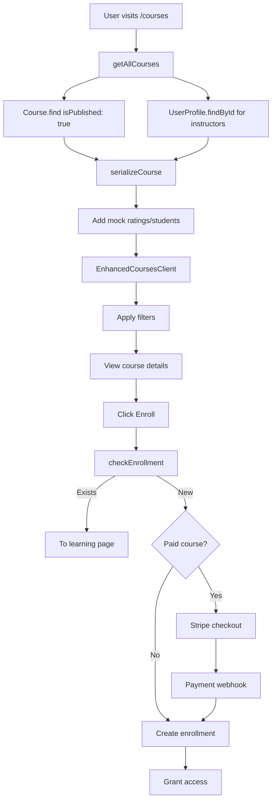
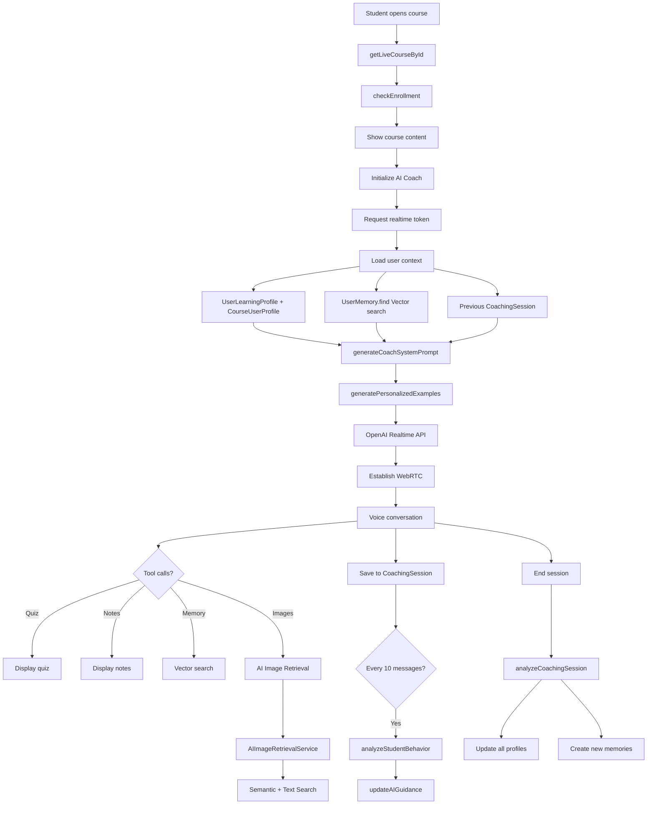
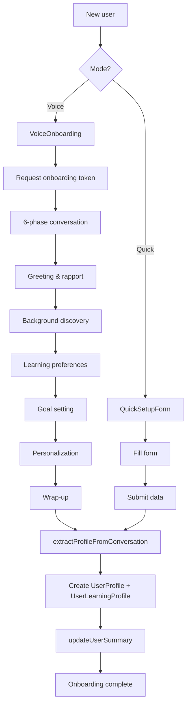

# CLAUDE.md

This file provides guidance to Claude Code (claude.ai/code) when working with code in this repository.

---

## ⚠️ IMPORTANT: Before Responding to Any Query

**ALWAYS follow this process:**
1. **Think thoroughly** about the request and its implications
2. **Read this CLAUDE.md** to understand the complete codebase architecture
3. **Check existing implementations** in relevant files before suggesting changes
4. **Make atomic changes** - small, focused modifications that don't break existing functionality
5. **Verify database schemas and API contracts** before modifying
6. **Test implications** across the interconnected system

---

## 🌟 Executive Summary

Voice Assistant is a revolutionary AI-powered educational platform that transforms online learning through personalized AI coaching, real-time voice interactions, and adaptive course management. Built with cutting-edge technologies, it serves students, instructors, and administrators with a seamless, intelligent learning ecosystem that remembers everything, adapts continuously, and provides truly personalized education at scale.

## 🗂️ Complete Project Structure

```
Voice Assistant-1/
├── app/                                 # Next.js 15 App Router
│   ├── (auth)/                        # Authentication pages
│   │   ├── sign-in/                   # Sign in page
│   │   └── sign-up/                   # Sign up page
│   │
│   ├── (public)/                      # Public routes (no auth)
│   │   ├── page.tsx                   # Landing page
│   │   ├── courses/                   # Course discovery
│   │   │   ├── page.tsx              # Course listing
│   │   │   └── [courseId]/           # Course details
│   │   │       └── page.tsx
│   │   └── components/                # Public components
│   │       ├── HeroSection.tsx
│   │       ├── FeaturesSection.tsx
│   │       └── TestimonialsSection.tsx
│   │
│   ├── (protected)/                   # Auth-required routes
│   │   └── (dashboard)/              # Dashboard layout
│   │       ├── student/              # Student portal
│   │       │   ├── dashboard/       # Student home
│   │       │   ├── courses/         # Enrolled courses
│   │       │   │   └── [courseId]/  # Learning page
│   │       │   │       ├── page.tsx
│   │       │   │       └── components/
│   │       │   │           ├── ModernCourseContent.tsx
│   │       │   │           ├── RealtimeAICoach.tsx
│   │       │   │           ├── AnimatedFace.tsx
│   │       │   │           ├── AudioAnalyzer.tsx
│   │       │   │           └── VoiceActivityDetector.tsx
│   │       │   ├── onboarding/      # New user setup
│   │       │   │   └── components/
│   │       │   │       ├── VoiceOnboarding.tsx
│   │       │   │       ├── QuickSetupForm.tsx
│   │       │   │       └── ProfileExtractionTool.tsx
│   │       │   ├── research/        # Deep research
│   │       │   └── profile/         # User profile
│   │       │
│   │       ├── instructor/          # Instructor portal
│   │       │   ├── page.tsx        # Dashboard
│   │       │   ├── courses/        # Course management
│   │       │   │   ├── create/     # New course
│   │       │   │   │   ├── page.tsx
│   │       │   │   │   ├── content/
│   │       │   │   │   └── with-research/
│   │       │   │   └── [courseId]/
│   │       │   │       ├── manage/
│   │       │   │       ├── images/
│   │       │   │       └── module/
│   │       │   ├── image-generation/
│   │       │   └── students/       # Student tracking
│   │       │
│   │       └── admin/              # Admin portal
│   │           ├── courses/       # Course review
│   │           │   └── review/   # Approval queue
│   │           ├── users/        # User management
│   │           └── settings/     # Platform settings
│   │
│   └── api/                        # API routes
│       ├── ai/                     # AI endpoints
│       │   ├── realtime-token/   # WebRTC tokens
│       │   ├── onboarding-token/ # Onboarding
│       │   ├── chat/             # Text chat
│       │   ├── tts/              # Text-to-speech
│       │   ├── research-token/   # Research
│       │   └── image-search/     # AI image search
│       │
│       ├── course-images/          # Image management
│       │   ├── generate/         # DALL-E generation
│       │   ├── agent-generate/   # Batch generation
│       │   ├── gallery/          # Gallery retrieval
│       │   ├── edit/            # Image editing
│       │   ├── save/            # Save/unsave
│       │   ├── delete/          # Deletion
│       │   ├── signed-url/      # S3 URLs
│       │   ├── download/        # File download
│       │   └── create/          # Upload record
│       │
│       ├── auth/                   # Authentication
│       │   └── [...nextauth]/
│       │
│       ├── payments/               # Stripe
│       │   └── success/
│       │
│       ├── webhooks/               # External hooks
│       │   ├── stripe/          # Payment events
│       │   └── research-complete/ # AI callbacks
│       │
│       ├── profiles/               # User profiles
│       │   ├── completion/      # Profile completion
│       │   └── onboarding-data/ # Session data
│       │
│       ├── upload/                 # File uploads
│       └── files/                  # File serving
│           └── [...path]/
│
├── components/                      # Reusable components
│   ├── ui/                        # Base UI (ShadCN)
│   │   ├── button.tsx
│   │   ├── card.tsx
│   │   ├── dialog.tsx
│   │   ├── form.tsx
│   │   ├── input.tsx
│   │   ├── select.tsx
│   │   ├── tabs.tsx
│   │   ├── toast.tsx
│   │   └── [50+ components]
│   │
│   ├── course/                    # Course components
│   │   └── ImageGallery.tsx     # Image management UI
│   │
│   ├── StudyTools/                # Learning widgets
│   │   ├── QuizWidget.tsx       # Interactive quizzes
│   │   ├── AINotesWidget.tsx    # Smart notes
│   │   └── AIWidgetStack.tsx    # Widget container
│   │
│   ├── RealtimeVoiceAgent/        # Voice AI
│   │   ├── RealtimeAgent.tsx
│   │   ├── AnimatedFace.tsx
│   │   ├── AudioAnalyzer.tsx
│   │   └── VoiceActivityDetector.tsx
│   │
│   └── EditorJS/                  # Rich text editor
│       ├── index.tsx
│       └── styles.css
│
├── lib/                            # Core libraries
│   ├── mongodb.ts                # DB connection
│   ├── storage.ts                # S3 interface
│   ├── auth0.ts                  # Auth config
│   ├── stripe.ts                 # Payment setup
│   ├── utils.ts                  # Utilities
│   │
│   ├── ai/                       # AI system
│   │   ├── AITool.ts            # Base tool class
│   │   ├── ToolRegistry.ts      # Tool management
│   │   ├── ImageGenerationOrchestrator.ts
│   │   │
│   │   ├── tools/               # AI tools
│   │   │   ├── CourseControl/
│   │   │   │   ├── GenerateQuiz.ts
│   │   │   │   ├── GenerateNotes.ts
│   │   │   │   ├── DismissQuiz.ts
│   │   │   │   └── NextChapter.ts
│   │   │   ├── OnboardingTools/
│   │   │   │   ├── ProfileExtractionTool.ts
│   │   │   │   └── OnboardingEndSessionTool.ts
│   │   │   ├── Research/
│   │   │   │   └── InitiateDeepResearch.ts
│   │   │   ├── SessionControl/
│   │   │   │   └── EndSession.ts
│   │   │   ├── RetriveMemory.ts
│   │   │   ├── AIImageRetrievalTool.ts
│   │   │   ├── CourseImageGeneration.ts
│   │   │   └── CourseImageCaptionGeneration.ts
│   │   │
│   │   ├── prompts/             # System prompts
│   │   │   ├── coach-prompt.ts
│   │   │   ├── tom-prompt.ts
│   │   │   └── onboarding-prompt.ts
│   │   │
│   │   └── helpers/
│   │       └── imageRetrievalHelper.ts
│   │
│   └── core/
│       └── behavior/            # Behavioral analysis
│           ├── StudentBehaviorTracker.ts
│           ├── PatternDetectionSystem.ts
│           └── AIGuigance.ts
│
├── models/                         # Database schemas
│   ├── User.ts
│   ├── UserProfile.ts
│   ├── Course.ts
│   ├── CourseImage.ts
│   ├── Enrollment.ts
│   ├── FileMetadata.ts
│   ├── ResearchStatus.ts
│   └── ai-coach/
│       ├── UserLearningProfile.ts
│       ├── CourseUserProfile.ts
│       ├── CoachingSession.ts
│       ├── UserMemory.ts
│       ├── OnboardingSession.ts
│       ├── SessionAnalysisReport.ts
│       └── FeedbackTracking.ts
│
├── actions/                        # Server actions
│   ├── user.ts
│   ├── course.ts
│   ├── enrollment.ts
│   ├── payment.ts
│   ├── memory-retrival.ts
│   ├── instructor/
│   │   └── chapter.ts
│   └── ai/
│       ├── actions.ts
│       ├── agent.ts
│       ├── coach.ts
│       ├── onboarding.ts
│       ├── analysis.ts
│       ├── course-research.ts
│       ├── course-processing.ts
│       └── image-generation-agent.ts
│
├── services/                       # Service layer
│   ├── course-image.service.ts
│   └── ai-image-retrieval.service.ts
│
├── hooks/                          # React hooks
│   ├── use-toast.ts
│   ├── use-ai-coach.ts
│   ├── use-debounce.ts
│   └── use-file-upload.ts
│
├── contexts/                       # React contexts
│   └── AuthContext.tsx
│
├── types/                          # TypeScript types
│   ├── index.ts
│   ├── research.ts
│   └── editor.d.ts
│
├── middleware.ts                   # Auth middleware
├── next.config.js                  # Next.js config
├── tailwind.config.ts             # Tailwind config
├── tsconfig.json                  # TypeScript config
├── package.json                   # Dependencies
└── .env.local                     # Environment vars
```

## 🗄️ Complete Database Schema

### Core User Models

#### User (Authentication)
```typescript
{
  _id: ObjectId,
  email: string (unique, indexed),
  password: string (hashed),
  role: 'student' | 'instructor' | 'admin',
  isEmailVerified: boolean,
  createdAt: Date,
  updatedAt: Date
}
```

#### UserProfile (Extended Profile)
```typescript
{
  _id: ObjectId,
  userId: ObjectId (ref: User, unique),
  auth0Id: string (unique),
  name: string,
  bio: string,
  avatar: string,
  phone: string,
  
  learningPreferences: {
    preferredLanguage: string,
    learningPace: 'slow' | 'moderate' | 'fast',
    specialNeeds: string[]
  },
  
  interests: string[],
  goals: string[],
  
  location: {
    country: string,
    state: string,
    city: string
  },
  
  education: {
    level: string,
    fieldOfStudy: string,
    institution: string
  },
  
  occupation: {
    title: string,
    company: string,
    industry: string
  },
  
  socialLinks: {
    linkedin: string,
    twitter: string,
    github: string
  },
  
  achievements: [{
    title: string,
    date: Date,
    description: string
  }],
  
  onboardingCompleted: boolean,
  onboardingCompletedAt: Date,
  
  createdAt: Date,
  updatedAt: Date
}

Indexes:
- { userId: 1 } (unique)
- { auth0Id: 1 } (unique)
- { email: 1 }
- { onboardingCompleted: 1 }
```

#### UserLearningProfile (AI Personalization)
```typescript
{
  _id: ObjectId,
  userId: ObjectId (ref: User, unique),
  
  // Learning characteristics
  learningStyle: 'visual' | 'auditory' | 'kinesthetic' | 'reading_writing',
  preferredSessionDuration: number (minutes),
  bestLearningTime: 'morning' | 'afternoon' | 'evening' | 'night',
  motivationalStyle: 'supportive' | 'challenging' | 'balanced',
  communicationPreference: 'formal' | 'casual' | 'mixed',
  
  // Focus areas
  focusAreas: string[],
  strengths: string[],
  weaknesses: string[],
  
  // AI settings
  adaptiveLearningEnabled: boolean,
  aiCoachPersonality: 'encouraging' | 'serious' | 'playful' | 'nova',
  
  // Cognitive metrics (1-10)
  analyticalAbility: number,
  criticalThinking: number,
  problemSolving: number,
  creativity: number,
  memoryRetention: number,
  
  lastUpdated: Date,
  createdAt: Date,
  updatedAt: Date
}

Indexes:
- { userId: 1 } (unique)
- { lastUpdated: -1 }
```

#### UserMemory (RAG Vector Storage)
```typescript
{
  _id: ObjectId,
  userId: ObjectId (ref: User),
  
  // Content
  type: 'learning_pattern' | 'personal_context' | 'course_specific' | 'general',
  content: string,
  embedding: number[] (1536 dimensions),
  
  // Metadata
  metadata: {
    courseId?: ObjectId,
    sessionId?: ObjectId,
    importance: number (1-5),
    lastAccessed: Date,
    accessCount: number
  },
  
  // Search optimization
  tags: string[],
  searchableText: string,
  
  createdAt: Date,
  expiresAt?: Date
}

Indexes:
- { userId: 1, type: 1 }
- { userId: 1, 'metadata.importance': -1 }
- { userId: 1, 'metadata.courseId': 1 }
- { embedding: 'vector' } (Atlas Vector Search)
- { content: 'text' } (Full-text search)
```

### Course Models

#### Course
```typescript
{
  _id: ObjectId,
  title: string,
  description: string,
  category: string,
  level: 'beginner' | 'intermediate' | 'advanced',
  instructorId: ObjectId (ref: User),
  
  // Embedded chapters
  chapters: [{
    _id: ObjectId,
    title: string,
    content: string (EditorJS JSON),
    videoUrl?: string,
    order: number,
    isPublished: boolean,
    isFree: boolean,
    duration?: number (minutes),
    resources?: [{
      title: string,
      type: 'pdf' | 'video' | 'link',
      url: string
    }],
    createdAt: Date,
    updatedAt: Date
  }],
  
  // Media
  imageUrl?: string,
  previewVideoUrl?: string,
  
  // Pricing
  price: number,
  currency: string (default: 'USD'),
  
  // Publishing
  isPublished: boolean,
  reviewStatus: 'draft' | 'pending' | 'approved' | 'rejected',
  reviewComment?: string,
  publicVersion?: Mixed (snapshot),
  publishedAt?: Date,
  
  // Statistics
  averageRating?: number,
  totalReviews?: number,
  enrolledStudents?: number,
  completionRate?: number,
  
  // AI-generated
  isAIGenerated?: boolean,
  researchId?: string,
  isPrivate?: boolean,
  ownerId?: ObjectId,
  
  createdAt: Date,
  updatedAt: Date
}

Indexes:
- { instructorId: 1, createdAt: -1 }
- { reviewStatus: 1, isPublished: 1 }
- { category: 1, level: 1, isPublished: 1 }
- { ownerId: 1, isPrivate: 1 }
- { title: 'text', description: 'text' }
```

#### CourseImage
```typescript
{
  _id: ObjectId,
  courseId: ObjectId (ref: Course),
  chapterId?: string,
  
  // Core data
  prompt: string (main caption),
  imageUrl: string (S3 key),
  base64Data?: string (temporary),
  
  // Search optimization
  description: string,
  searchableText: string,
  aiTags: string[],
  
  // Metadata
  metadata: {
    size: string,
    quality: 'low' | 'medium' | 'high',
    generatedBy: 'system' | 'user' | 'ai_coach',
    context?: string,
    originalPrompt?: string,
    enhancedDescription?: string,
    semanticKeywords?: string[],
    contentType?: string,
    visualElements?: any (GPT-4 Vision),
    autoDeleteAfter?: Date,
    editedFrom?: string,
    maskUsed?: string,
    editPrompt?: string
  },
  
  // User saves
  savedBy: [{
    userId: ObjectId,
    savedAt: Date,
    tags?: string[]
  }],
  
  isPublic: boolean,
  createdBy?: ObjectId,
  
  createdAt: Date,
  updatedAt: Date
}

Indexes:
- { courseId: 1, chapterId: 1 }
- { courseId: 1, 'savedBy.userId': 1 }
- { courseId: 1, aiTags: 1 }
- { courseId: 1, 'metadata.generatedBy': 1 }
- { prompt: 'text', description: 'text', searchableText: 'text' }
```

#### Enrollment
```typescript
{
  _id: ObjectId,
  studentId: ObjectId (ref: User),
  courseId: ObjectId (ref: Course),
  
  // Progress tracking
  enrolledAt: Date,
  completedChapters: string[] (chapter IDs),
  lastAccessedChapter?: string,
  lastAccessedAt?: Date,
  progress: number (0-100),
  
  // Status
  status: 'active' | 'completed' | 'paused',
  completionDate?: Date,
  
  // Certification
  certificateIssued: boolean,
  certificateIssuedAt?: Date,
  certificateUrl?: string,
  
  // Metrics
  totalTimeSpent: number (minutes),
  averageSessionDuration: number,
  quizScores: [{
    chapterId: string,
    score: number,
    date: Date
  }],
  
  createdAt: Date,
  updatedAt: Date
}

Indexes:
- { studentId: 1, courseId: 1 } (unique)
- { studentId: 1, status: 1 }
- { courseId: 1, enrolledAt: -1 }
- { status: 1, lastAccessedAt: -1 }
```

### AI Coaching Models

#### CoachingSession
```typescript
{
  _id: ObjectId,
  userId: ObjectId (ref: User),
  courseId?: ObjectId (ref: Course),
  chapterId?: string,
  
  // Session info
  sessionType: 'voice' | 'text',
  status: 'active' | 'completed' | 'abandoned',
  startedAt: Date,
  endedAt?: Date,
  duration?: number (seconds),
  
  // Conversation
  messages: [{
    role: 'user' | 'assistant' | 'system',
    content: string,
    timestamp: Date,
    metadata?: {
      toolCalls?: [{
        tool: string,
        args: Mixed,
        result: Mixed
      }],
      audioUrl?: string,
      transcriptionConfidence?: number
    }
  }],
  
  // Tools & features used
  toolsUsed: string[],
  widgetsDisplayed: string[],
  
  // Analysis
  summary?: string,
  insights?: {
    keyPoints: string[],
    confusionPoints: string[],
    masteredConcepts: string[]
  },
  behaviorAnalysis?: {
    engagementLevel: number (1-10),
    comprehensionScore: number (1-10),
    frustrationLevel: number (1-10),
    recommendations: string[]
  },
  
  createdAt: Date,
  updatedAt: Date
}

Indexes:
- { userId: 1, startedAt: -1 }
- { userId: 1, courseId: 1, chapterId: 1 }
- { status: 1, startedAt: -1 }
```

#### OnboardingSession
```typescript
{
  _id: ObjectId,
  userId: ObjectId (ref: User),
  sessionId: string (unique),
  
  // Session details
  mode: 'voice' | 'quick',
  status: 'active' | 'completed' | 'abandoned',
  
  // Profile data collection
  profileData: {
    name?: string,
    occupation?: string,
    interests?: string[],
    goals?: string[],
    learningStyle?: string,
    availability?: string
  },
  
  // Conversation (voice mode)
  messages: [{
    role: 'user' | 'assistant',
    content: string,
    timestamp: Date
  }],
  
  // Extracted data
  extractedProfile?: Mixed,
  toolCallCount: number,
  
  // Timing
  startedAt: Date,
  completedAt?: Date,
  duration?: number (minutes),
  
  createdAt: Date,
  updatedAt: Date
}

Indexes:
- { sessionId: 1 } (unique)
- { userId: 1, status: 1 }
- { status: 1, startedAt: -1 }
```

#### CourseUserProfile
```typescript
{
  _id: ObjectId,
  userId: ObjectId (ref: User),
  courseId: ObjectId (ref: Course),
  
  // Course-specific metrics
  comprehensionLevel: number (1-10),
  engagementScore: number (1-10),
  pacePreference: 'slower' | 'normal' | 'faster',
  
  // Mastery tracking
  masteredConcepts: [{
    conceptName: string,
    masteryLevel: number (1-10),
    achievedAt: Date,
    reviewCount: number
  }],
  
  misunderstoodConcepts: [{
    conceptName: string,
    severity: 'minor' | 'moderate' | 'major',
    attempts: number,
    lastAttempt: Date
  }],
  
  // Personalization
  preferredExplanationStyle: string,
  customExamples: string[],
  personalNotes: string[],
  bookmarkedContent: [{
    chapterId: string,
    position: string,
    note: string
  }],
  
  lastUpdated: Date,
  createdAt: Date,
  updatedAt: Date
}

Indexes:
- { userId: 1, courseId: 1 } (unique)
- { userId: 1, 'masteredConcepts.masteryLevel': -1 }
```

#### ResearchStatus
```typescript
{
  _id: ObjectId,
  requestId: string (unique),
  userId: ObjectId (ref: User),
  
  // Research details
  type: 'course_learning' | 'general_research',
  originalRequest: string,
  enrichedPrompt?: string,
  
  // Status tracking
  status: 'processing' | 'completed' | 'failed',
  progress: number (0-100),
  currentStep: string,
  estimatedCompletion?: Date,
  
  // Results
  result?: {
    enrichedRequest: string,
    suggestedQuestions: string[],
    recommendations: Mixed,
    resources: [{
      title: string,
      url: string,
      relevance: number
    }],
    courseId?: ObjectId
  },
  
  // Metadata
  metadata: {
    model: string,
    tokenCount: number,
    processingTime: number
  },
  
  error?: string,
  
  createdAt: Date,
  completedAt?: Date
}

Indexes:
- { requestId: 1 } (unique)
- { userId: 1, status: 1 }
- { status: 1, createdAt: -1 }
```

## 🔄 Core System Flows

### 1. Public Course Discovery & Enrollment Flow



### 2. Student Learning Flow with AI Coach



### 3. Instructor Course Creation Flow

```mermaid
graph TD
    Start[Instructor dashboard] --> Create[Create course]
    Create --> Choose{Creation method?}
    
    Choose -->|Standard| Manual[Manual creation]
    Manual --> Details[Enter course details]
    Details --> SaveDraft[Save as draft]
    
    Choose -->|Research| Research[Deep research /instructor/courses/create/with-research]
    Research --> Intent[analyzeLearningIntent]
    Intent --> AIResearch[executeDeepResearch]
    AIResearch --> Structure[structureIntoCourse]
    Structure --> SaveDraft
    
    SaveDraft --> Content[Add content]
    Content --> Chapters[Create chapters]
    Chapters --> Editor[EditorJS content]
    
    Content --> Images[Generate images]
    Images --> ImageHub[/instructor/image-generation]
    ImageHub --> Orchestrator[ImageGenerationOrchestrator]
    Orchestrator --> Captions[CourseImageCaptionGeneration GPT-4]
    Captions --> BatchDalle[DALL-E 3 batch generation]
    BatchDalle --> Upload[Custom image upload with captions]
    Upload --> Store[Store in CourseImage]
    Store --> Approval[Admin approval workflow]
    
    Content --> Submit[Submit for review]
    Submit --> Pending[reviewStatus: pending]
```

### 4. Onboarding Flow



## 🤖 AI System Architecture

### System Prompts

#### Coach System Prompt (`lib/prompts/coach-prompt.ts`)
```typescript
Components:
- User name and profile data
- Current chapter content
- Learning style preferences
- Course progress metrics
- Memory search instructions
- Tool usage guidelines
- Voice delivery rules
- Behavioral guidelines

Injection: /api/ai/realtime-token/route.ts
```

#### Tom/Nova Personality (`lib/prompts/tom-prompt.ts`)
```typescript
Enhanced Features:
- Warmer personality traits
- Example generation based on interests
- Advanced tool usage patterns
- Dynamic quiz/note generation
- Celebration behaviors
- Adaptive communication style
```

#### Onboarding Prompt (`lib/prompts/onboarding-prompt.ts`)
```typescript
Phases:
1. Opening (30-60s): Warm greeting, set expectations
2. Core Discovery (2-3m): Name, occupation, location
3. Learning Preferences (2-3m): Style, timing, pace
4. Goals (2-3m): Short/long-term objectives
5. Personalization (1-2m): AI personality selection
6. Wrap-up (30s): Confirmation and next steps

Tools: UPDATE_PROFILE (10+ calls), END_SESSION
```

### AI Tools Registry

#### Course Control Tools

1. **GENERATE_QUIZ** (`GenerateQuiz.ts`)
   - Creates 2-4 multiple choice questions
   - Supports single/multi-select
   - Includes explanations
   - Personality-based styling

2. **GENERATE_NOTES** (`GenerateNotes.ts`)
   - Types: heading, term, equation, concept, tip
   - Importance levels: low, medium, high, critical
   - Display variants: spotlight, notebook, flashcard, bulletin

3. **DISMISS_QUIZ** (`DismissQuiz.ts`)
   - Reasons: declined, answered_verbally
   - Clears widget state

4. **NEXT_CHAPTER** (`NextChapter.ts`)
   - Navigate to next chapter
   - Update progress

#### Memory & Search Tools

5. **MEMORY_SEARCH** (`RetriveMemory.ts`)
   - Vector similarity search
   - MongoDB aggregation pipeline
   - Returns top 10 relevant memories
   - Includes importance scoring

6. **AI_IMAGE_RETRIEVAL** (`AIImageRetrievalTool.ts`)
   - Search course images
   - Text and semantic search
   - Filter by course/chapter

#### Session Control

7. **END_SESSION** (`EndSession.ts`)
   - Save conversation
   - Trigger analysis
   - Update profiles
   - Clean up connections

8. **END_ONBOARDING_SESSION** (`OnboardingEndSessionTool.ts`)
   - Extract profile data
   - Create user profiles
   - Award achievements

#### Profile Tools

9. **UPDATE_PROFILE** (`ProfileExtractionTool.ts`)
   - Real-time profile updates
   - Fields: name, interests, goals, style
   - Instant capture during conversation

#### Image Generation

10. **GENERATE_COURSE_IMAGES** (`CourseImageGeneration.ts`)
    - Context-aware prompts
    - Auto-save to gallery
    - Educational optimization

11. **GENERATE_COURSE_IMAGE_CAPTIONS** (`CourseImageCaptionGeneration.ts`)
    - Batch caption creation
    - Module-specific prompts
    - GPT-4 analysis

#### Research Tools

12. **INITIATE_DEEP_RESEARCH** (`InitiateDeepResearch.ts`)
    - Webhook-based async
    - 5-15 minute processing
    - Course generation

13. **ADMIN_IMAGE_GENERATION_AGENT** (`AdminImageGenerationAgent.ts`) **NEW**
    - Admin-only batch image generation
    - Comprehensive image pipeline
    - Multiple variations per caption
    - Progress tracking
    - Global and module-specific images

### Memory System (RAG)

#### Embedding Generation
```typescript
// Generate embedding
const embedding = await openai.embeddings.create({
  model: 'text-embedding-ada-002',
  input: text
});
// Returns 1536-dimensional vector
```

#### Vector Search
```typescript
// MongoDB Atlas Vector Search
const memories = await UserMemory.aggregate([
  {
    $vectorSearch: {
      queryVector: embedding,
      path: "embedding",
      numCandidates: 100,
      limit: 10,
      index: "vector_index",
      filter: { userId: ObjectId(userId) }
    }
  },
  {
    $project: {
      content: 1,
      importance: 1,
      score: { $meta: "vectorSearchScore" }
    }
  }
]);
```

#### Memory Creation
```typescript
// Automatic memory extraction
const insights = await captureKeyInsights(conversation);
for (const insight of insights) {
  const embedding = await generateEmbedding(insight);
  await UserMemory.create({
    userId,
    content: insight,
    embedding,
    type: determineType(insight),
    metadata: { importance: calculateImportance(insight) }
  });
}
```

## 🎨 UI Component System

### Image Upload & Management

#### ImageUploadWithCaption (NEW)
```typescript
Features:
- Drag & drop image upload
- Mandatory caption requirement (min 10 chars)
- Real-time validation
- AI retrieval optimization
- Preview functionality
- Error handling
- Progress tracking
- Educational focus warnings

Caption Requirements:
- Minimum 10 characters
- Enables AI semantic search
- Improves accessibility
- Provides learning context
```

#### ImageGenerationAgent (NEW)
```typescript
Features:
- Complete admin interface
- Course selection & validation
- Settings configuration
- Real-time progress tracking
- Batch image generation
- Custom prompt support
- Upload integration
- Approval workflow
- Regeneration capabilities

States:
- Course loading/selection
- Generation progress
- Results display
- Approval management
- Error handling
```

### Study Widgets

#### QuizWidget
```typescript
Features:
- 2-4 questions per quiz
- Single/multi-select
- Real-time feedback
- Personality theming:
  - warm: Orange/amber gradients
  - encouraging: Green/emerald gradients
  - playful: Purple/pink gradients
- Celebration animations
- Explanation reveals
```

#### AINotesWidget
```typescript
Note Types:
- heading: Slate theme, large text
- term: Blue theme, definition format
- equation: Purple theme, math rendering
- concept: Green theme, explanations
- highlight: Yellow theme, emphasis
- tip: Orange theme, actionable

Display Variants:
- spotlight: Dramatic single item
- notebook: Organized grid
- flashcard: Compact cards
- bulletin: Announcements
```

#### AnimatedFace (AI Avatar)
```typescript
States:
- idle: Breathing animation
- listening: Attentive, active
- thinking: Processing indicator
- speaking: Mouth sync
- excited: Celebrations

Features:
- Eye tracking
- Eyebrow expressions
- Smile variations
- Blink patterns
- Emotion transitions
```

### Voice Interface

#### VoiceActivityDetector
```typescript
Configuration:
- Threshold: 25 (speaking detection)
- Sample rate: 16000 Hz
- FFT size: 256
- Update interval: 100ms

Visual Feedback:
- Pulsing rings
- Level meters
- Permission states
- Error indicators
```

#### AudioAnalyzer
```typescript
Features:
- Real-time FFT
- Frequency visualization
- Volume normalization
- Echo cancellation
- Noise suppression
- WebRTC integration
```

### Image Gallery

#### ImageGallery Component
```typescript
Features:
- Grid/list views
- Batch operations
- AI generation
- Upload/edit/delete
- Save collections
- Metadata display
- Filter/search
- Drag & drop

Instructor Features:
- Batch AI generation
- Approval workflow
- Bulk operations
- Vision enhancement
```

## 🎛️ Instructor Dashboard System (NEW)

### Main Dashboard (`/instructor/page.tsx`)
```typescript
Components:
- Stats Overview: Courses, Students, Revenue, Ratings
- Quick Actions: Image generation, Content editing, Analytics
- Course Portfolio: Recent courses with status badges
- Activity Feed: Enrollments, reviews, completions
- Progress Tracking: Completion rates, satisfaction metrics
- Alert System: Pending reviews, action items

Features:
- Real-time statistics
- Navigation shortcuts
- Visual progress indicators
- Status management
- Performance metrics
```

### Deep Research Route (`/instructor/courses/create/with-research`)
```typescript
Workflow:
1. Learning intent analysis
2. AI research execution
3. Course structure generation
4. Content organization
5. Chapter creation

Integration:
- OpenAI deep research models
- Webhook-based processing
- Progress tracking
- Result structuring
```

### Enhanced Module Editor (`/instructor/courses/[courseId]/module/[moduleId]`)
```typescript
Features:
- Live sync capabilities
- Auto-save functionality
- Content tabs (Content, Media, Images, Materials)
- Real-time collaboration
- Progress indicators
- Error handling
- Image gallery integration
- AI generation access
```

### Image Generation Hub (`/instructor/image-generation`)
```typescript
Capabilities:
- Batch AI image generation
- Course content analysis
- Caption generation via GPT-4
- DALL-E 3 integration
- Custom image uploads
- Approval workflows
- Progress tracking
- Admin-only access control
```

## 🔌 API Endpoints

### AI Services (`/api/ai/*`)

#### `/api/ai/realtime-token`
```typescript
POST - Generate WebRTC token
Process:
1. Authenticate user
2. Load UserLearningProfile
3. Load CourseUserProfile
4. Fetch UserMemory (vector search)
5. Get last CoachingSession
6. Generate system prompt
7. Create ephemeral key
8. Return token + session ID

Response: {
  EPHEMERAL_KEY: string,
  sessionId: string,
  userId: string,
  expiresAt: Date
}
```

#### `/api/ai/onboarding-token`
```typescript
POST - Onboarding session token
Includes:
- Onboarding-specific prompt
- Profile extraction tools
- Session tracking
- Mode configuration
```

#### `/api/ai/chat`
```typescript
POST - Text-based chat (deprecated)
Use: actions/ai/coach.ts instead
```

#### `/api/ai/tts`
```typescript
POST - Text-to-speech
Models: tts-1, tts-1-hd
Voices: alloy, echo, fable, onyx, nova, shimmer
Format: mp3, opus, aac, flac
```

#### `/api/ai/image-search` (NEW)
```typescript
POST - AI-powered image search
Features:
- Semantic search capabilities
- Query enhancement via GPT-4
- Multi-course search support
- Content type filtering
- Access control integration
- Relevance scoring
- Metadata enrichment

Body: {
  query: string,
  courseId?: string,
  courseIds?: string[],
  semanticSearch?: boolean,
  contentTypes?: string[],
  limit?: number
}

Response: {
  success: boolean,
  images: ImageResult[],
  total: number,
  searchMetadata: {
    query: string,
    searchType: 'text' | 'semantic' | 'hybrid',
    processingTime: number
  }
}
```

### Course Images (`/api/course-images/*`)

#### `/api/course-images/generate`
```typescript
POST - Single/batch generation
Body: {
  courseId: string,
  prompt: string,
  count?: number,
  quality?: 'low' | 'medium' | 'high'
}
Process:
1. Enhance prompt with context
2. Call DALL-E 3
3. Upload to S3
4. Create CourseImage record
5. Enhance with GPT-4 Vision
```

#### `/api/course-images/agent-generate` (NEW)
```typescript
POST - AI orchestrated batch generation
Body: {
  courseId: string,
  variationsPerCaption?: number,
  quality?: 'low' | 'medium' | 'high',
  includeGlobalImages?: boolean,
  includeModuleImages?: boolean,
  additionalPrompts?: string[]
}

Process:
1. Course validation & access control
2. Generate captions (CourseImageCaptionGeneration)
3. Create images (DALL-E 3 via generateCourseImages)
4. Store with enhanced metadata
5. Return organized results

Response: {
  success: boolean,
  status: 'completed' | 'error',
  generatedImages: GeneratedImageSet[],
  totalImages: number,
  message: string
}
```

#### `/api/course-images/create` (NEW)
```typescript
POST - Create CourseImage database record
Use: After successful image upload/generation
Body: {
  courseId: string,
  imageUrl: string,
  prompt: string,
  description: string,
  metadata: ImageMetadata
}

Features:
- Database record creation
- Metadata attachment
- AI tag generation
- Search optimization
```

### File Management

#### `/api/upload`
```typescript
POST - File upload to S3
Limits:
- Images: 10MB
- Videos: 100MB
- Documents: 50MB

Security:
- Type validation
- Size limits
- Virus scanning
- Permission checks
```

### Webhooks

#### `/api/webhooks/stripe`
```typescript
Events:
- checkout.session.completed
- payment_intent.succeeded
- subscription.created/updated/deleted
- invoice.payment_succeeded/failed

Actions:
- Verify signature
- Process payment
- Update enrollment
- Grant/revoke access
```

#### `/api/webhooks/research-complete`
```typescript
POST - OpenAI research callback
Process:
1. Verify webhook signature
2. Extract research content
3. Structure into course (8-12 chapters)
4. Generate assessments
5. Create Course record
6. Update ResearchStatus
```

## 🖼️ Advanced Image Generation System (NEW)

### ImageGenerationOrchestrator

#### Pipeline Management
```typescript
Stages:
1. Initialization & Validation
   - Course access verification
   - User permission checks
   - Settings validation

2. Course Content Analysis
   - Chapter content extraction
   - Key concept identification
   - Context preparation

3. Caption Generation
   - CourseImageCaptionGeneration tool
   - GPT-4 analysis
   - Module-specific prompts
   - Global course themes

4. Image Generation
   - DALL-E 3 integration
   - Batch processing
   - Variation creation
   - Quality control

5. Custom Image Processing
   - Upload handling
   - Caption validation
   - Metadata extraction
   - Storage management

6. Results Organization
   - Module categorization
   - Approval workflow
   - Progress reporting
```

#### Advanced Features
```typescript
Capabilities:
- Progress callbacks
- Session tracking
- Error recovery
- Approval management
- Regeneration support
- Batch operations
- Metadata enhancement

Result Structure:
{
  success: boolean,
  stage: 'initializing' | 'analyzing_course' | 'generating_captions' | 
         'generating_images' | 'processing_uploads' | 'completed' | 'error',
  progress: {
    currentStep: number,
    totalSteps: number,
    percentage: number,
    message: string,
    details: string
  },
  generatedImages: GeneratedImageResult[],
  totalImages: number,
  sessionId: string
}
```

### AIImageRetrievalService (NEW)

#### Advanced Search Capabilities
```typescript
Search Types:
- Text-based: Standard MongoDB text search
- Semantic: AI-enhanced query expansion
- Hybrid: Combined text + semantic + tag search
- Tag-based: Specific tag matching

Query Enhancement:
- GPT-4 query expansion
- Semantic tag generation
- Keyword enrichment
- Educational terminology focus

Access Control:
- Course-based filtering
- User permission validation
- Public/private image handling
- Cross-course search support
```

#### Search Options
```typescript
interface AIImageSearchOptions {
  courseId?: string;
  courseIds?: string[];
  chapterId?: string;
  contentTypes?: string[];
  generatedBy?: 'system' | 'user' | 'ai_coach';
  includePublicOnly?: boolean;
  userId?: string;
  limit?: number;
  semanticSearch?: boolean;
  accessibleCourses?: string[];
}
```

#### Metadata Enhancement
```typescript
AI Analysis:
- Image description enhancement
- Semantic keyword extraction
- Content type classification
- Educational value assessment

Content Types:
- diagram, illustration, photo
- infographic, chart, concept
- other (catchall)

Enhancement Process:
1. Load existing image metadata
2. GPT-4 analysis of prompt + context
3. Generate enhanced descriptions
4. Extract semantic keywords
5. Classify content type
6. Update database record
```

## 🚀 Advanced Features

### Deep Research Pipeline

#### 1. Intent Analysis
```typescript
analyzeLearningIntent({
  studentRequest: string,
  preferredDuration: string,
  specificGoals: string[]
}) => {
  clarifyingQuestions: string[],
  enrichedPrompt: string,
  suggestedLevel: string,
  recommendedTopics: string[]
}
```

#### 2. Research Execution
```typescript
executeDeepResearch({
  enrichedPrompt: string,
  userId: string
}) => {
  // Async webhook-based
  // 5-15 minutes processing
  // OpenAI o4-mini-deep-research
}
```

#### 3. Course Structuring
```typescript
structureResearchIntoCourse({
  researchContent: string,
  userId: string
}) => {
  title: string,
  description: string,
  chapters: [{
    title: string,
    content: string (2000-4000 words),
    learningObjectives: string[],
    keyConcepts: string[]
  }],
  assessments: Quiz[],
  projects: Project[]
}
```

### Behavioral Analysis

#### Real-time Analysis (Every 10 Messages)
```typescript
analyzeStudentBehavior({
  messages: Message[],
  profile: UserLearningProfile
}) => {
  engagementLevel: number,
  comprehension: number,
  frustrationLevel: number,
  recommendations: string[],
  adjustments: {
    pace?: 'slower' | 'faster',
    complexity?: 'simpler' | 'deeper',
    style?: 'more_examples' | 'more_theory'
  }
}
```

#### Post-Session Analysis
```typescript
analyzeCoachingSession(sessionId) => {
  // Async background job
  performLLMAnalysis() => insights
  updateUserProfileFromAnalysis(insights)
  updateCourseProfileFromAnalysis(insights)
  createSessionAnalysisReport(insights)
  extractAndStoreMemories(conversation)
}
```

### Adaptive Learning Engine

#### Personalization Factors
```typescript
AdaptationEngine.adjust({
  learningPace: userProfile.pace,
  difficultyLevel: courseProfile.comprehension,
  exampleSelection: userProfile.interests,
  explanationDepth: userProfile.style,
  quizComplexity: performance.average,
  sessionDuration: userProfile.preferredDuration,
  breakReminders: engagement.fatigue
})
```

## 🔒 Security & Performance

### Authentication & Authorization

#### Auth Flow
```typescript
1. Auth0 login → JWT token
2. Session creation (NextAuth)
3. Role validation (middleware.ts)
4. Resource permissions check
5. Action execution
```

#### Permission Matrix
```typescript
Student:
- View public courses
- Enroll in courses
- Access enrolled content
- Use AI coach
- Manage profile

Instructor:
- All student permissions
- Create/edit courses
- View student analytics
- Generate images
- Submit for review

Admin:
- All instructor permissions
- Review courses
- Manage users
- Platform settings
- View analytics
```

### Database Optimization

#### Critical Indexes
```typescript
// High-frequency queries
Course: { 
  instructorId: 1, 
  reviewStatus: 1,
  isPublished: 1,
  category: 1
}

Enrollment: { 
  studentId: 1, 
  courseId: 1 
} (compound unique)

UserMemory: { 
  userId: 1, 
  'metadata.importance': -1 
}

// Vector search
UserMemory: { 
  embedding: 'vector' 
}

// Text search
Course: { 
  title: 'text', 
  description: 'text' 
}
```

#### Connection Pooling
```typescript
// lib/mongodb.ts
const options = {
  maxPoolSize: NODE_ENV === 'production' ? 50 : 10,
  minPoolSize: 5,
  maxIdleTimeMS: 30000,
  serverSelectionTimeoutMS: 5000,
  socketTimeoutMS: 45000,
  family: 4
};
```

### Performance Optimization

#### Caching Strategy
```typescript
// User profiles: 5 min TTL
// Course metadata: 10 min TTL
// AI responses: Common queries cached
// File URLs: 1 hour TTL
// Static assets: CDN with long cache
```

#### Query Optimization
```typescript
// Use .lean() for read-only
const courses = await Course.find().lean();

// Select specific fields
const users = await User.find()
  .select('name email role')
  .lean();

// Pagination
const results = await Course.find()
  .skip(page * limit)
  .limit(limit);
```

## 🛠️ Development Patterns

### Server Actions
```typescript
'use server'

export async function actionName(params: Type): Promise<Result> {
  try {
    // 1. Authentication
    const user = await getCurrentUser();
    if (!user) return { success: false, error: 'Unauthorized' };
    
    // 2. Authorization
    if (!hasPermission(user, 'action')) {
      return { success: false, error: 'Forbidden' };
    }
    
    // 3. Validation
    const validated = validateInput(params);
    if (!validated.success) {
      return { success: false, error: validated.error };
    }
    
    // 4. Business logic
    await connectToDatabase();
    const result = await performOperation(validated.data);
    
    // 5. Cache invalidation
    revalidatePath('/relevant/path');
    
    // 6. Return serialized
    return { 
      success: true, 
      data: serializeDocument(result) 
    };
    
  } catch (error) {
    console.error('Action failed:', error);
    return { 
      success: false, 
      error: error instanceof Error ? error.message : 'Unknown error' 
    };
  }
}
```

### AI Tool Pattern
```typescript
export class CustomTool extends AITool<Params, Result> {
  name = 'TOOL_NAME';
  description = 'Tool purpose';
  
  parameters = {
    type: 'object',
    properties: {
      param1: { 
        type: 'string', 
        description: 'Description' 
      }
    },
    required: ['param1']
  };
  
  async execute(params: Params, context: Context): Promise<Result> {
    try {
      // Tool logic
      const result = await operation(params);
      return { success: true, data: result };
    } catch (error) {
      return { success: false, error: error.message };
    }
  }
}

// Register
ToolRegistry.registerTool(new CustomTool());
```

### Component Patterns
```typescript
// Client Component
'use client'

interface Props {
  data: SerializedData;
  onAction?: (id: string) => void;
}

export function ClientComponent({ data, onAction }: Props) {
  const [state, setState] = useState(initialState);
  const [loading, setLoading] = useState(false);
  
  const handleAction = async () => {
    setLoading(true);
    try {
      const result = await serverAction(params);
      if (result.success) {
        toast({ title: 'Success' });
        onAction?.(result.data.id);
      }
    } finally {
      setLoading(false);
    }
  };
  
  return <div>{/* JSX */}</div>;
}

// Server Component
export async function ServerComponent({ params }: PageProps) {
  const data = await fetchData(params);
  return <ClientComponent data={data} />;
}
```

## 📝 Common Issues & Solutions

### Image Generation Issues

#### DALL-E 3 Limitations
```typescript
// Problem: DALL-E 3 only supports n=1 (single image per request)
// Solution: Loop for multiple variations
for (let variation = 0; variation < variationsPerCaption; variation++) {
  const imageResult = await generateCourseImages({
    count: 1, // Always 1 for DALL-E 3
    prompt: variation === 0 ? caption : `${caption} (style variation ${variation + 1})`
  });
}
```

#### Caption Requirements
```typescript
// Problem: Images without captions can't be found by AI
// Solution: Mandatory caption validation
if (!caption.trim() || caption.trim().length < 10) {
  throw new Error('Caption must be at least 10 characters for AI retrieval');
}
```

#### Image Access Control
```typescript
// Problem: Complex permission handling across courses
// Solution: Comprehensive access query
const accessQuery = {
  $or: [
    { isPublic: true },
    { 'savedBy.userId': userObjectId },
    { createdBy: userObjectId },
    { 'metadata.generatedBy': 'system', courseId: { $in: accessibleCourseIds } }
  ]
};
```

### Upload & File Management

#### File Processing Pipeline
```typescript
// Problem: Files need proper metadata for AI retrieval
// Solution: Comprehensive processing
const processImage = async (file: File, caption: string) => {
  // 1. Validate file type and size
  // 2. Generate unique filename
  // 3. Upload to storage
  // 4. Create database record with AI tags
  // 5. Extract basic tags from caption
  // 6. Generate searchable text
};
```

### TypeScript Issues

#### Set Iteration Error
```typescript
// Problem: Type 'Set<any>' can only be iterated through when using '--downlevelIteration'
// Solution:
Array.from(new Set([...array]))  // Instead of [...new Set(...)]
```

#### Mongoose _id Type
```typescript
// Problem: 'courseImage._id' is of type 'unknown'
// Solution:
(document._id as mongoose.Types.ObjectId).toString()
```

#### EditorJS Type Definitions (NEW)
```typescript
// Problem: Missing type declarations for EditorJS plugins
// Solution: Create types/editor.d.ts
declare module '@editorjs/marker' {
  const Marker: any;
  export default Marker;
}

declare module '@editorjs/inline-code' {
  const InlineCode: any;
  export default InlineCode;
}
// ... additional plugin declarations
```

#### Image Orchestrator Types
```typescript
// Problem: Complex nested interfaces for image generation
// Solution: Well-defined type structure
interface ImageGenerationRequest {
  courseId: string;
  userId: string;
  settings: {
    variationsPerCaption: number;
    quality: 'low' | 'medium' | 'high';
    includeGlobalImages: boolean;
    includeModuleImages: boolean;
  };
  additionalPrompts?: string[];
  customImages?: Array<{
    file: File;
    caption: string;
  }>;
  preUploadedImages?: Array<{
    filePath: string;
    fileName: string;
    fileSize: number;
    fileType: string;
    caption: string;
  }>;
}
```

